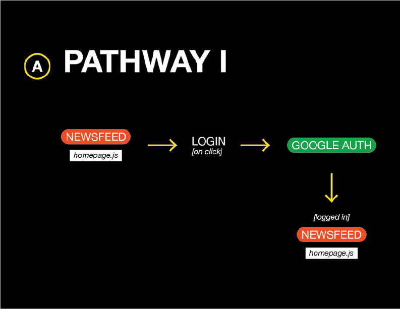
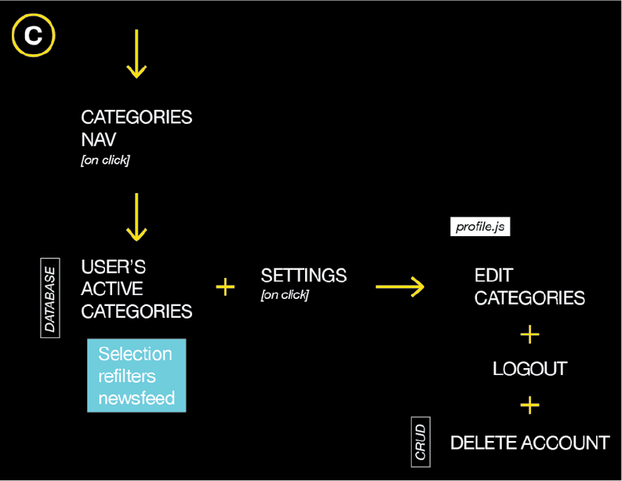

# Untrending

### Purpose:

#### Untrending aims to expand readers' perspectives when consuming the news by offering related articles across the media bias spectrum.

### Motivation: 

Intentionally or not, we often get pulled into a media bias when reading the news. Wether it's because we are actively seeking reinforcing and therefore comforting perspectives or we are simply the victims of algorithms running news aggregators. These algorithms are designed, as they are in many tech platforms, to maximize our attention for ad revenue generation. Keeping these users is typically done by appealing to their interests, which when applied to news means suggesting articles that reinforce a user's point of view. 

Untrending is built to reverse exactly that effect. Here, users will be offered differing views on the same topic. This is in an effort to expand the user's perspective and gently nudge them out of their bias or in the very least not strengthen it. Productive conersations and public discourse is diffucult to conduct without each side at least being informed of the other.

### Team:

**Sherrie Lin** Front-end development, UIUX design
 
**Ado Moshe** Back-end development

### News Ranking:

We decided to use Ad Fontes media bias chart for our news source bias ranking as it seems to be the most prominent and trusted. Ad Fontes ranks news sources on their bias and quality, this is all of course subjective but through a large data set should yield the mutual feeling of most. Ad Fontes attempts to overcome these barriers as much as possible by ranking media outlets during the same news cycle, using large datasets, diversity of analysts, as well as refined methods and rubrics.

Quality rankings are assesed by picking apart each sentence and rating it on a 1-5 scale based on how true it is factually and if it is more opinion or fact. Fairness of the sentence is also a factor, even if a sentence is absolutely true it may be used in order to blatantly persuade readers of some agenda, and is taken into account.

Bias is also approached carefully. Topic presentation is evaluated starting in the headline, it is see through "political position, characterization, and terminology". Bias is mostly evaluated through omissions, comparing the target article to others about the same topic to see what other facts were omitted.

Media source quality is ranked vertically from "Original fact reporting" to "Contains inaccurate/fabricated information" with 6 steps in between. Bias is ranked horizontally from "Most extreme left" to "Most extreme right" with 5 steps in between.

More info: https://www.adfontesmedia.com/how-ad-fontes-ranks-news-sources/

Untrending only displays articles from sources that fall under the "Original fact reporting" to "Complex analysis" on the quality scale because we do not see the value of any "deeper analysis" that prevents readers from doing some of the heavy lifting of forming opinions on their own. Not surprisingly CNN and FOX do not fall into these categories, but since they are so popular we have included them to stay on our mission to expose such partisans to differing opinions. We have also capped the bias rating at halfway through the "Hyper-partisan" category staying within the yellow rectange which is described as "fair interpretations of the news".

#### `FLOW`
<ul>
<li>On the homepage the user will see all trending articles. User also has the option of signing in with their Google account (Passport.js for authorization)</li>
</ul>

<ul>
<li> After logging in and if the user is new to Untrending, he or she will be presented with a few categories in order to curate a personal homepage newsfeed based on their interests. Once the user has picked their categories of interest, they will hit submit and be redirected to the homepage which will now present the latest articles from their categories of choice.</li>
</ul>

<ul>
<li>If the user has previously logged in and their categories of choice are stored in the database then the homepage will reload and present them with the latest articles relevant to those categories</li>
 
<li>User can also search articles by keyword</li>
 
<li>Once the user clicks on an article Untrending suggests a few relevant articles from news outlets that are more centrist or slightly biased to the opposing side, depending on how biased the original news source is (we do not want the par to be too large or the user might feel their viewpoint is attacked)</li>
</ul>

#### `TECHNOLOGY`

-HTML, CSS, & Javascript 
-News API 
-Express, mySQL, Sequelize, & Passport Google Authorization

###### DEPLOYED VIA HEROKU ON JANUARY 11, 2019. Link: https://untrending.herokuapp.com

