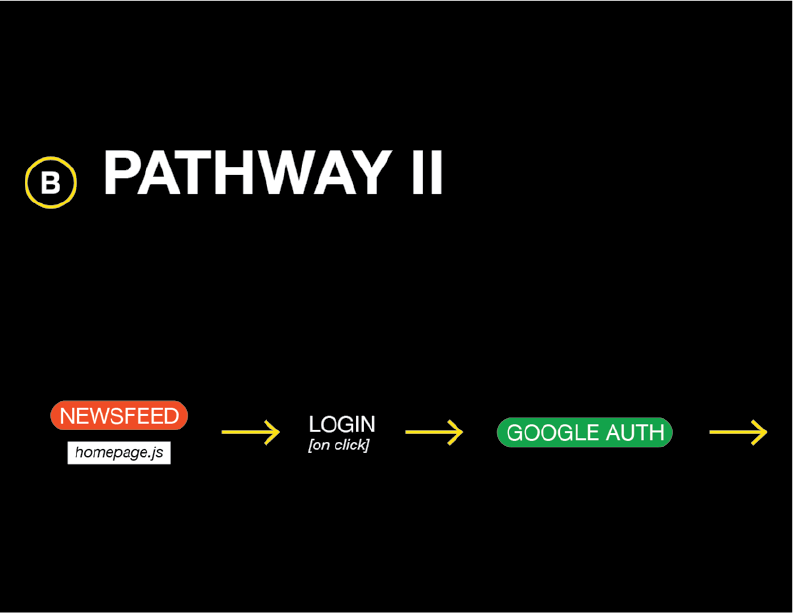

# Untrending

### Purpose:

#### Untrending aims to expand readers' perspectives when consuming the news by offering related articles across the bias spectrum.

### Motivation: 

Intentionally or not, we often get pulled into a media bias when reading the news. Wether it's because we are actively seeking reinforcing and therefore comforting perspectives or we are simply the victims of algorithms running news aggregators. These algorithms are designed, as they are in many tech platforms, to maximize our attention for ad revenue generation. Keeping these users is typically done by appealing to their interests, which when applied to news means suggesting articles that reinforce a user's point of view. 

Untrending is built to reverse exactly that effect. Here, users will be offered differing views on the same topic. This is in an effort to expand the user's perspective and gently nudge them out of their bias or in the very least not strengthen it. Productive conersations and public discourse is diffucult to conduct without each side at least being informed of the other.

### Team:

**Sherrie Lin** Front-end development, UIUX design
 
**Ado Moshe** Back-end development

### HOW Untrending WORKS:

#### `FLOW`
<ul>
<li>On the homepage the user will see all trending articles. User also has the option of signing in with their Google account (Passport.js for authorization)</li>
</ul>

<ul>
<li> After logging in and if the user is new to Untrending, he or she will be presented with a few categories in order to curate a personal homepage newsfeed based on their interests. Once the user has picked their categories of interest, they will hit submit and be redirected to the homepage which will now present the latest articles from their categories of choice.</li>
</ul>

<ul>
<li>If the user has previously logged in and their categories of choice are stored in the database then the homepage will reload and present them with the latest articles relevant to those categories</li>
 
<li>User can also search articles by keyword</li>
 
<li>Once the user clicks on an article Untrending suggests a few relevant articles from news outlets that are more centrist or slightly biased to the opposing side, depending on how biased the original news source is (we do not want the par to be too large or the user might feel their viewpoint is attacked)</li>
</ul>

#### `TECHNOLOGY`

-Written in HTML, CSS, & Javascript 
-Utilizes News API & REST Countries API 
-Uses Express, mySQL2, Sequelize, & Passport Google Authorization

###### DEPLOYED VIA HEROKU ON JANUARY 11, 2019. Link: https://untrending.herokuapp.com

